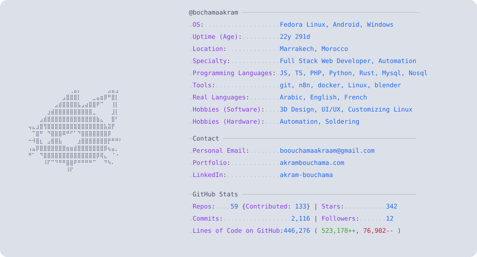

<div align="center">    

```
                                                                                
          )                        )                     )                      
    )  ( /( (       )    )      ( /(         (        ( /(     )     )       )  
 ( /(  )\()))(   ( /(   (       )\())  (    ))\   (   )\()) ( /(    (     ( /(  
 )(_))((_)\(()\  )(_))  )\   ' ((_)\   )\  /((_)  )\ ((_)\  )(_))   )\  ' )(_)) 
((_)_ | |(_)((_)((_)_  ((_))   | |(_) ((_)(_))(  ((_)| |(_)((_)_ )_((_)) ((_)_ ) 
/ _` || / /| '_|/ _` || '  \   | '_ \/ _ \| || |/ _| | ' \ / _` || '  \()/ _` | 
\__,_||_\_\|_|  \__,_||_|_|_|  |_.__/\___/ \_,_|\__| |_||_|\__,_||_|_|_| \__,_| 
                                                                                
```                                                                                 
  <h3>junior full-stack web developer</h3>
  <h5>passionate about 3D design and game dev</h5>

  <p>
    How to reach me: <b>boouchamaakraam@gmail.com</b> <br>
    My portfolio website: <a href="https://akrambouchama.com"><b>akrambouchama.com</b></a>
  </p>

  <p><a href="mailto:boouchamaakraam@gmail.com"></a>
    <a href="https://www.linkedin.com/in/akram-bouchama-8b287532a/"></a>
  </p>
</div>

---

<a href="https://github.com/bochamaakram/bochamaakram">
  <picture>
    <source media="(prefers-color-scheme: dark)" srcset="dark_mode.svg">
    
  </picture>
</a>

---

<div align="center">
  
  
</div>